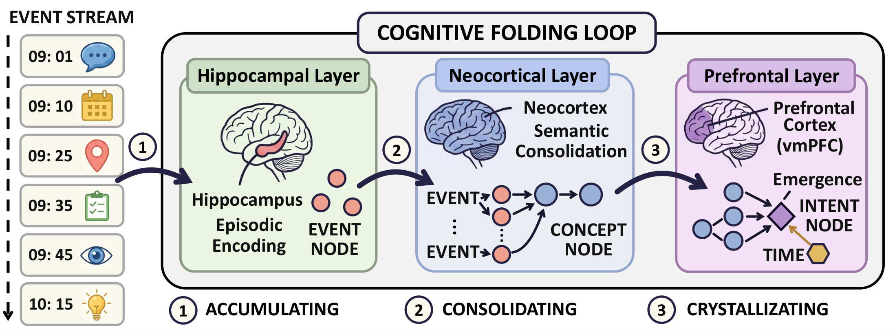
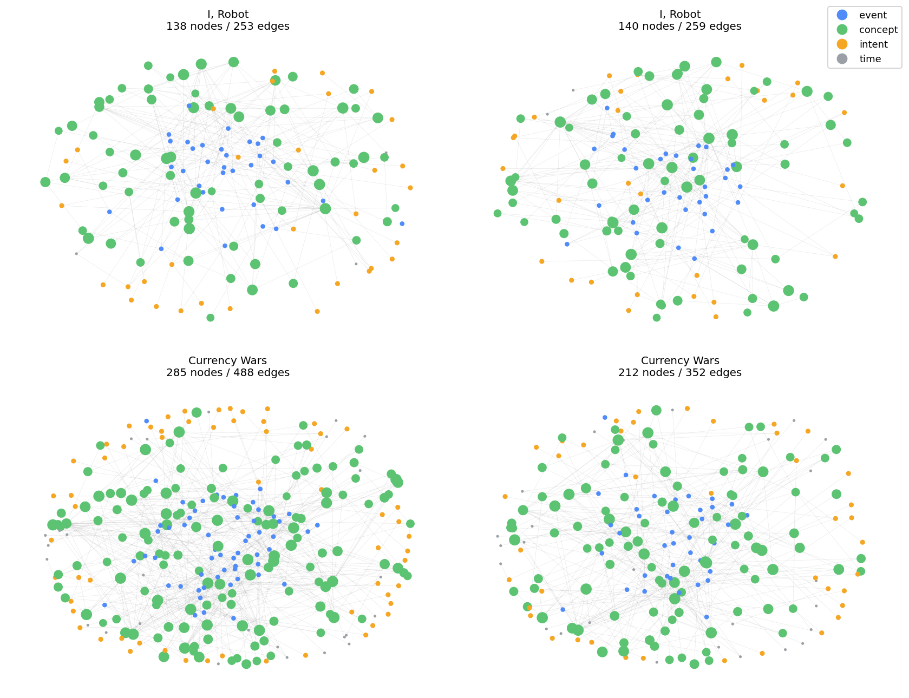

<div align="center">

<h1>CogniFold: Always-On Proactive Memory<br/>via Cognitive Folding</h1>

<a href="https://opennorve.github.io/CogniFold/" target="_blank"></a>
<a href="https://opennorve.github.io/CogniFold/" target="_blank"></a>
<a href="https://arxiv.org/abs/2605.13438" target="_blank"></a>
<a href="https://huggingface.co/datasets/OpenNorve/CogEval-Bench" target="_blank"></a>
<br/>
<a href="https://github.com/OpenNorve/CogniFold/actions/workflows/ci.yml"></a>
<a href="docs/INTEGRATIONS.md"></a>
<a href="LICENSE"></a>
<a href="https://www.python.org/"></a>

</div>

<p><em>A <strong>brain-inspired always-on agent memory</strong> that folds continuously arriving events into self-emerging cognitive structure — designed for the next generation of proactive assistants. Neural-inspired by design: memory systems are mapped to the brain regions that implement them, not metaphorically borrowed.</em></p>

<p align="center"><strong>🧠 Brain Memory Coverage: ~60%</strong> of the human memory taxonomy modeled (working, episodic, semantic, prospective, temporal) — see the live breakdown at <a href="https://opennorve.github.io/CogniFold/">opennorve.github.io/CogniFold</a> or query <code>GET /api/v1/brain/coverage</code>.</p>

<div align="center">

<a href="https://opennorve.github.io/CogniFold/"><b>🌐 Live Demo</b></a> &nbsp;·&nbsp; <a href="docs/ARCHITECTURE.md"><b>🏗️ Architecture</b></a> &nbsp;·&nbsp; <a href="docs/DEPLOYMENT.md"><b>🚀 Deploy</b></a> &nbsp;·&nbsp; <a href="docs/INTEGRATIONS.md"><b>🔌 Integrations</b></a> &nbsp;·&nbsp; <a href="docs/PROMPTS.md"><b>✍️ Prompt Profiles</b></a> &nbsp;·&nbsp; <a href="docs/NORTH_STAR_METHODOLOGY.md"><b>🧭 North Star</b></a>

</div>

<div align="center">



</div>

---

## 📖 Table of Contents

- [🎯 Highlights](#-highlights)
- [🧠 Concepts in 60 seconds](#-concepts-in-60-seconds)
- [🎬 Demo](#-demo)
- [🛠️ Installation](#️-installation)
- [🚀 Quick Start](#-quick-start)
- [🔌 Integrations & Deployment](#-integrations--deployment)
- [⚙️ Key Configurations](#️-key-configurations)
- [🔁 Benchmark Evaluation](#-benchmark-evaluation)
- [🗺️ Roadmap: modeling the rest of the brain](#️-roadmap-modeling-the-rest-of-the-brain)
- [📂 Project Structure](#-project-structure)
- [🔗 Citation](#-citation)
- [📜 License](#-license)

---

## 🎯 Highlights

1. **🔮 Proactive Memory.** Proactivity is a property of the memory substrate, not the agent's policy — goals emerge from the topology that accumulates the conditions for them.
2. **🧠 Architecture.** A tri-layered substrate extending Complementary Learning Systems with a prefrontal Intent layer — events fold into concepts, concepts crystallize into intents, surfaced through a hierarchical context window.
3. **🌱 Conceptual Bootstrapping.** Accumulation, compression, decay, completion — four structural debts of a streaming event log, resolved as transparent graph rewrites: test-time learning without gradient updates or surface text rewriting.
4. **📊 Evaluation.** CogEval-Bench isolates proactive emergence from retrieval accuracy; seven downstream benchmarks confirm the substrate stays robust on conventional memory tasks.

## 🧠 Concepts in 60 seconds

CogniFold ingests an asynchronous event stream and folds it into a typed concept graph. Four node types — the first three mirror Complementary Learning Systems (CLS) theory:

| Node | ID prefix | Layer | Role |
|---|---|---|---|
| `event` | `e-` | Hippocampal | Episodic trace — each input committed verbatim |
| `concept` | `c-` | Neocortical | Semantic pattern abstracted from recurring events |
| `intent` | `i-` | Prefrontal | Crystallizes when a concept cluster crosses density — *this is what makes memory proactive* |
| `time` | `t-` | — | Temporal anchor (deadlines, scheduled times) |

Eight typed/weighted edges (`GROUNDS`, `CAUSES`, `TRIGGERS`, `REINFORCES`, `PART_OF`, `DERIVED_FROM`, `DEADLINE_FOR`, `RELATED_TO`) wire them. Two ways to read the graph:

- **Proactive Context Window** *(no query asked)* — read the live `immediate / working / background` bands; intents surface on their own.
- **Memory Query Agent** *(explicit query)* — retrieve via `bm25` / `semantic` / `hybrid` modes, optionally wrapped in an agentic multi-round loop.

Details and tunables: [⚙️ Key Configurations](#️-key-configurations).

## 🎬 Demo

**1. Proactive memory in motion.** The graph folds events, crystallizes concepts, and surfaces intents.

<div align="center">

<video src="https://github.com/user-attachments/assets/e2ed5131-d145-4f6b-9ac8-a28be50d6e70" controls width="86%"></video>

</div>

**2. Substrate across narratives.** *I, Robot* (top) and *Currency Wars* (bottom), two stream snapshots each.

<div align="center">



</div>

## 🛠️ Installation

### Prerequisites

| Requirement | Notes |
|---|---|
| Python ≥ 3.11 | 3.14 tested in CI |
| `uv` (recommended) or `pip` | `uv` gives ~10× faster installs |
| LLM API key (optional) | Google `GOOGLE_API_KEY` or OpenAI `OPENAI_API_KEY` — only needed for agent / semantic retrieval / agentic mode |

### Step-by-step

```bash
# 1. Clone the repository
git clone https://github.com/OpenNorve/CogniFold.git
cd CogniFold

# 2. Install (pick one)
uv sync                                    # fastest, uses uv.lock
pip install -e ".[agent,service]"          # core + agent + HTTP service
pip install -e ".[dev,agent,service,viz]"  # everything (dev tools, viz, FAISS)

# 3. Configure API keys
cp .env.example .env
# edit .env and set GOOGLE_API_KEY or OPENAI_API_KEY
```

## 🚀 Quick Start

### CLI demo (no LLM required — uses BM25 retrieval)

```bash
# 1. Generate a sample timeline (a saved demo is also under data/generated/)
cognifold generate --domain personal-timeline --persona software_engineer --events 50

# 2. Build the concept graph
cognifold run data/generated/alex_chen_timeline.json --save-graph output/graph.json

# 3. Query the graph
cognifold query --graph output/graph.json --retrieval bm25 "morning routine"

# 4. Replay the graph evolution as an interactive HTML
cognifold replay logs/replay_alex_chen_timeline_*.jsonl -o output/replay.html --open
```

### Python — proactive context window (no query)

```python
from cognifold import NodeType
from cognifold.graph.persistence import load_graph
from cognifold.scoring.hierarchical import HierarchicalContextSelector

# Load a previously saved graph
graph = load_graph("output/graph.json")
print(f"nodes={graph.node_count}  edges={graph.edge_count}")

# Read the live, always-on context window — no query asked!
context = HierarchicalContextSelector().select_context(graph)

print(f"\nimmediate ({context.immediate.node_count} nodes — top-of-mind):")
for n in context.immediate.nodes[:5]:
    print(f"  [{n.type.value}] {n.data.get('title', n.id)}")

print(f"\nworking ({context.working.node_count} nodes — active patterns)")
print(f"background ({context.background.node_count} nodes — historical)")

# Emergent intents surface here without anyone asking
intents = graph.get_nodes_by_type(NodeType.INTENT)
print(f"\n{len(intents)} intents emerged from the graph state:")
for i in intents[:5]:
    print(f"  [{i.id}] {i.data.get('title', '?')}  status={i.data.get('status', '?')}")

# Example output (50-event personal timeline):
# nodes=78  edges=124
#
# immediate (8 nodes — top-of-mind):
#   [event]   Met with team about Q3 plan
#   [intent]  Schedule follow-up with marketing
#   [concept] product launch coordination
#   [event]   Coffee with Sarah at Blue Bottle
#   [event]   Reviewed candidate resume
#
# working (23 nodes — active patterns)
# background (47 nodes — historical)
#
# 3 intents emerged from the graph state:
#   [i-7]  Schedule follow-up with marketing  status=pending
#   [i-12] Buy birthday gift for Sarah        status=pending
#   [i-15] Q3 OKR review prep                 status=in_progress
```

### Python — explicit query (reactive)

```python
from cognifold.query.agent import MemoryQueryAgent
from cognifold.query.config import QueryConfig

agent = MemoryQueryAgent(graph, config=QueryConfig(retrieval_mode="hybrid"))
result = agent.query("What did I commit to about exercise?")
print(result.context_text)
```

### HTTP service

```bash
./scripts/start_server.sh                       # default :8000
cognifold client --url http://localhost:8000    # interactive REPL

# Or hit the API directly
curl -X POST http://localhost:8000/api/v1/sessions
curl http://localhost:8000/docs                 # OpenAPI / Swagger UI
```

## 🔌 Integrations & Deployment

CogniFold is more than a library — it ships as an HTTP service, an MCP server, and a live showcase, so it drops into existing agent stacks without glue code.

| Surface | How | Docs |
|---|---|---|
| **MCP server** | Plug CogniFold memory into Claude Code / Claude Desktop / Cursor — `pip install 'cognifold[mcp]'`, then run `cognifold-mcp`. Tools: `remember`, `query`, `graph_stats`, `list_intents`. | [INTEGRATIONS.md](docs/INTEGRATIONS.md) |
| **One-command backend** | `make serve` (local) · `docker compose up` (container) · Cloud Run (CD already wired). | [DEPLOYMENT.md](docs/DEPLOYMENT.md) |
| **Scenario prompt profiles** | `cognifold --list-profiles`; then `run`/`query --profile <name>` to switch scenario-tuned prompts. | [PROMPTS.md](docs/PROMPTS.md) |
| **Brain-coverage API** | `GET /api/v1/brain/coverage` — the live data behind the [brain visualization](https://opennorve.github.io/CogniFold/). | [Live site](https://opennorve.github.io/CogniFold/) |

## ⚙️ Key Configurations

### Retrieval modes (Memory Query Agent)

Set via `QueryConfig(retrieval_mode=...)`. The four modes select the **entry point** into the graph for an explicit query:

| Mode | When to use | Needs LLM key? |
|---|---|---|
| `legacy` | original keyword matching, minimal dependency | No |
| `bm25` | TF-IDF inverted index; fast and deterministic | No |
| `semantic` | embedding-based vector search | Yes (Google / OpenAI) |
| `hybrid` *(default)* | BM25 + semantic via RRF fusion; best general accuracy | Yes — auto-degrades to BM25 if no embedder |

For hard multi-hop queries, wrap with `AgenticRetriever`: it runs `hybrid` first, asks an LLM whether the result is sufficient, and if not, expands the query in parallel and re-ranks via RRF.

### Read-window bands (Proactive Context Window)

`HierarchicalContextSelector().select_context(graph)` returns three bands, each a different *attention regime*:

| Band | Default size | Score weights |
|---|---|---|
| `immediate` | 10% of window | recency 0.7 + urgency 0.3 |
| `working` | 30% of window | PageRank 0.5 + recency 0.3 + type 0.2 *(favors concepts)* |
| `background` | 50% of window | PageRank 0.8 + diversity 0.2 |

The window is read *anytime* — no query is required. Intents that crossed the crystallization threshold appear in `immediate` automatically; concepts that are being reinforced live in `working`; durable structure sinks to `background`.

### Most-used CLI flags (benchmark runners)

| Flag | Purpose |
|---|---|
| `--event-stream` | enable inter-session consolidation (`merge_similar_concepts` + `prune_orphan_concepts`); **required for paper-grade LoCoMo** |
| `--query-mode {base, rag, episodic, mergefold}` | ablation switch: `mergefold` = full CogniFold; others are baselines |
| `--disable-concepts` | events-only baseline (skips concept formation) |
| `--model openai:gpt-5` | reader model |
| `--judge-model openai:gpt-4o` | LLM-as-judge for QA scoring (auto-derived from `--model` if omitted) |
| `--limit N` | cap number of examples (smoke-testing) |
| `--no-llm-eval` | skip LLM judging step (use exact-match / F1 only) |

Environment overrides accepted by `scripts/reproduce.sh`: `MODEL=...`, plus the LLM keys `OPENAI_API_KEY` / `GOOGLE_API_KEY` (from `.env`).

## 🔁 Benchmark Evaluation

### Headline results

Numbers below are as reported in the technical report (<a href="https://arxiv.org/abs/2605.13438">arXiv:2605.13438v3</a>, Tables 3–5 and Fig. 4).

| Benchmark | Metric | CogniFold | Note |
|---|---|:---:|---|
| **CogEval-Bench** | Proactivity / Purity | **0.614 / 0.361** | only system non-zero on Purity **and** Proactivity; 4.6× compression |
| **LongMemEval** | J-Score (overall) | **93.0%** | 500 Q; SSA 100.0 · SSU 97.1 · KU 94.9 · SSP 93.3 · MS 91.0 · TR 88.7 (vs Mastra 94.9, ENGRAM 71.4, Zep 71.2) |
| **LoCoMo** | J-Score (overall) | **81.23%** | vs ENGRAM 77.55 · MemOS 75.80 · Zep 75.14 (Mem0 protocol, `--event-stream`) |
| **MuSiQue** | F1 | **58.7** | exceeds HippoRAG 2 (49.3) |
| **BABILong** | Accuracy | **85.0** | exceeds ARMT — fine-tuned (83.8) |
| **ToMi** | EM | **83.5** | exceeds AutoToM (80.2) |
| **SafetyBench** | Accuracy | **94.3%** | exceeds GPT-4 zero-shot (88.9%) |
| **MuTual** | Accuracy | **93.2%** | near-SOTA dialogue coherence |
| **StreamingQA** | EM / F1 | **78.4% / 0.573** | streaming temporal QA |
| **NarrativeQA** | F1 / ROUGE-L | **0.720 / 0.712** | long-form comprehension |

<sub>Stack: build `gpt-4o-mini`, answer `gpt-5.4-mini` (LongMemEval) / `gpt-4o-mini` (LoCoMo + downstream), judge `gpt-4o` (LongMemEval) / `gpt-4o-mini` (LoCoMo), embeddings `text-embedding-3-small`. Full protocol, per-category tables, and ablations in <a href="docs/BENCHMARK.md">docs/BENCHMARK.md</a>. Numbers reproduce via <code>bash scripts/reproduce.sh</code>.</sub>

### Running the suite

One wrapper for everything — sane defaults, dataset auto-downloaded on first run, paper-faithful flags applied per benchmark.

```bash
# canonical run: LoCoMo full 10-conversation Mem0 protocol on the recommended stack
bash scripts/reproduce.sh

# any single benchmark (paper order — CogEval-Bench first, LoCoMo second)
bash scripts/reproduce.sh cogeval        # CogEval-Bench (structural diagnostic; the proactive thesis)
bash scripts/reproduce.sh locomo         # LoCoMo (default; Mem0 protocol)
bash scripts/reproduce.sh musique        # multi-hop QA
bash scripts/reproduce.sh narrativeqa    # narrative comprehension
bash scripts/reproduce.sh tomi           # theory of mind
bash scripts/reproduce.sh babilong       # long-context fact extraction
bash scripts/reproduce.sh mutual         # dialogue coherence
bash scripts/reproduce.sh streamingqa    # streaming temporal QA

# all 8 paper benchmarks back-to-back (CogEval + 7 downstream; uses MODEL env to override)
bash scripts/reproduce.sh all
```

Each run writes `benchmarks/<name>/output/benchmark_results.json`. Override the reader model via env: `MODEL=openai:gpt-4o bash scripts/reproduce.sh locomo`. The `--event-stream` flag is **automatically applied to LoCoMo** (it gates the inter-session consolidation pass central to the always-on memory thesis); all other benchmarks discharge consolidation through the shared `base_runner` post-ingestion hook.

## 🗺️ Roadmap: modeling the rest of the brain

CogniFold maps its mechanisms onto the human-memory taxonomy (Squire + Baddeley + CoALA) and reports an **honest coverage figure** — currently **~60%**. The live, machine-readable breakdown is `GET /api/v1/brain/coverage` and the interactive view is the [showcase site](https://opennorve.github.io/CogniFold/). True to the [North Star](docs/NORTH_STAR_METHODOLOGY.md), a mechanism only counts once it earns measurable payoff — we don't claim biological fidelity we haven't shipped.

| Status | Memory system | In CogniFold |
|:--:|---|---|
| ✅ Covered | Working · Episodic · Semantic · Prospective (intent) | hierarchical context · `event`/`concept`/`intent` nodes |
| 🟡 Partial | Temporal · Consolidation · Forgetting | `time` nodes · inter-session consolidation · recency decay + prune |
| ⬜ Planned | Procedural · Priming · Conditioning · Affective tagging · Sensory | tracked on the coverage map; pulled in as tasks demand them |

## 📂 Project Structure

```
cognifold/
├── src/cognifold/             # core library (20 submodules)
│   ├── __init__.py
│   ├── __main__.py
│   ├── config.py
│   ├── logging.py
│   ├── agent/                 # LangGraph agent, prompts, sections, domain configs
│   ├── cli/                   # CLI commands
│   ├── embeddings/            # Gemini / OpenAI providers, optional FAISS ANN
│   ├── executor/              # Plan execution with validation and rollback
│   ├── generator/             # Event generation (4 domains)
│   ├── graph/                 # NetworkX wrapper, persistence, validation, metrics
│   ├── importers/             # Data importers (wiki)
│   ├── intent/                # Intent-to-action system: queue, executor, calibrator
│   ├── models/                # Pydantic schemas (Event, Node, Edge, UpdatePlan)
│   ├── pipeline/              # Pipeline orchestration (classic + layered)
│   ├── query/                 # Query agent, strategies, assembly, LLM utilities
│   ├── replay/                # Graph evolution logging + interactive HTML
│   ├── retrieval/             # BM25, hybrid, agentic multi-round, cross-encoder
│   ├── scoring/               # PageRank, hierarchical context, node ranking
│   ├── service/               # HTTP service (FastAPI) — sessions, routes, auth, stores
│   ├── simulator/             # Timeline processing, visualization
│   ├── symbolic/              # Symbolic belief tracker, cognition / intent routers
│   ├── temporal/              # Temporal entity extraction, date parsing
│   ├── trace/                 # Tracing / instrumentation
│   └── utils/                 # Shared utilities (LLM metrics, budget, embeddings)
├── benchmarks/                # 8 benchmark runners + shared base-runner library
│   ├── shared/                # base_runner, baseline_runner, graph_evolution_tracker
│   ├── babilong/  cogeval/    locomo/        musique/
│   └── mutual/    narrativeqa/  streamingqa/  tomi/
├── configs/                   # per-benchmark prompt profiles (YAML)
├── examples/                  # sample timelines + replay HTML for 4 domains
├── scripts/                   # auxiliary scripts (LoCoMo audit-protocol rejudge, …)
├── docs/                      # ARCHITECTURE.md · BENCHMARK.md · PROMPTS.md
├── .github/                   # CI / CD workflows
├── cognifold                  # CLI entry-point shell launcher
├── config.example.yaml        # example application config
├── .env.example               # example environment file
├── generate_demo.py           # one-shot demo-graph generator
├── test_benchmarks.py         # smoke tests for the benchmark runners
├── pyproject.toml
├── uv.lock
├── Makefile
├── README.md
├── LICENSE
└── .gitignore
```

## 🔗 Citation

```bibtex
@article{wang2026cognifold,
  title   = {CogniFold: Always-On Proactive Memory via Cognitive Folding},
  author  = {Wang, Suli and Duan, Yiqun and Deng, Yu and Zhao, Rundong and Shi, Dai and Zhou, Xinliang},
  journal = {arXiv preprint arXiv:2605.13438},
  year    = {2026},
  url     = {https://arxiv.org/abs/2605.13438}
}
```

## 📜 License

Apache-2.0 — see [LICENSE](LICENSE).
